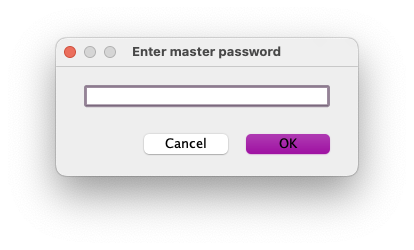

# jdbgen

## Introduction

jdbgen is a tool for generating text(source) files from database table
informations.

If you want to create model class in java or table headers in html
from database table, this tool will fit perfectly as you need.

## UI Workflow

### Master Password

Master password is used to encrypt/decrypt your database connection informations.

If you forgot master password, all customized informations will be lost.

### Connection Manager Window

Managing database connection informations, connection dependent templates and
options.

#### General Tab

|Field Name|Descriptions|
|---:|:---|
|Connection Name|Unique connection name which will be shown in left list|
|Driver|JDBC driver(can be managed by [Driver Manager Window](#driver-manager-window)|
|Connection URL|JDBC driver specific connection URL to database|
|User Name|Database user name|
|User Password|Database user password|
|Icon|Icon used in connection list(see [Icons Usage](#icons-usage))|
|Connection Props|Additional connection properties|
|Keep Alive|Execute dummy query every N seconds to keep alive connection|

#### Templates Tab

#### Options Tab

### Driver Manager Window

### Template Presets Window
