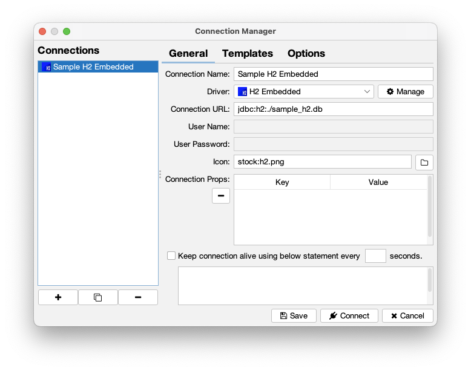
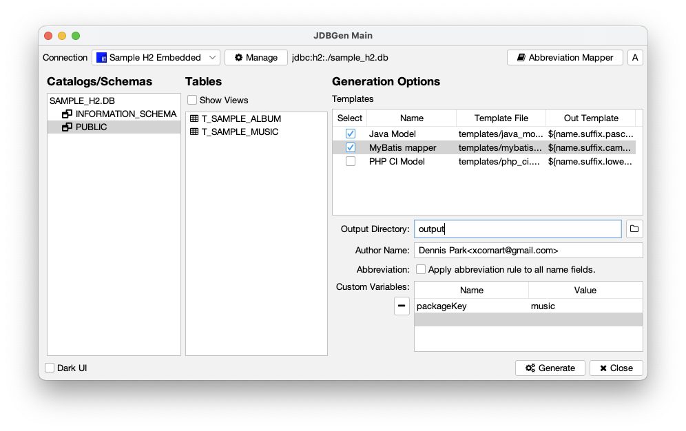

# jdbgen

## Introduction

jdbgen is a tool for generating text(source) files from database table
informations.

If you want to create model class in java or table headers in html
from database table, this tool will fit perfectly as you need.

## UI Workflow

### Master Password

Master password is used to encrypt/decrypt your database connection informations.

At the first time you run application, master password setting window appeared.

Next time you run the program, master password asking window appeared.

> Note! If you forgot master password, all customized informations will be lost.

### Connection Manager Window

Managing database connection informations, connection dependent templates and
options.

#### General Tab

|Name|Descriptions|
|---:|:---|
|Connection Name|Unique connection name which will be shown in left list|
|Driver|JDBC driver(can be managed by [Driver Manager Window](#driver-manager-window)|
|Connection URL|JDBC driver specific connection URL to database|
|User Name|Database user name|
|User Password|Database user password|
|Icon|Icon used in connection list(see [Icons Usage](#icons-usage))|
|Connection Props|Additional connection properties|
|Keep Alive|Execute dummy query every N seconds to keep alive connection|

#### Templates Tab

|Name|Descriptions|
|---:|:---|
|Template Name|A name for identifing template file|
|Template File|Template file location([Template Instructions](#template-instructions))|
|Output Name Template|Output file name template([Template Instructions](#template-instructions))|

You can create/manage template presets in [Template Preset Window](#template-preset-window).

#### Options Tab

|Name|Descriptions|
|---:|:---|
|Output Directory|Where the generated output files are written.|
|Author Name|Author text(`${author}` in template) which used in template. (ex. John Doe &lt;john.doe@abc.com&gt;)|
|Custom Variables|User defined `item type` variables which used in templates.|

### Driver Manager Window

Managing JDBC driver information, driver dependent properties.

Built-in drivers are cannot be modified in this window, but you can
create/clone driver informations.

#### General Tab

|Name|Descriptions|
|---:|:---|
|Driver Name|Unique driver name which will be shown in left list|
|JDBC Jar|JDBC driver(can be downloaded by [Maven Repository Window](#maven-repository-window)|
|URL Template|Driver specific JDBC connection URL template, which shown when creating new connection|
|Driver Class|`java.sql.Driver` implementation class (when click this field, implementation class list will be shown)|
|User Password|Database user password|
|Icon|Icon used in driver list(see [Icons Usage](#icons-usage))|
|Connection Props|Additional connection properties for this driver|

#### Custom Queries Tab

|Name|Descriptions|
|---:|:---|
|Get table comments|Getting table comments from schema in SQL(`${catalog}` and `${schema}` available)|
|Get table column comments|Getting table column comments from table in SQL(`${catalog}`, `${schema}` and `${table}` available)|
|Get table list|Getting tables from schema in SQL(`${catalog}` and `${schema}` available)|
|Get table column list|Getting table column list from table in SQL(`${catalog}`, `${schema}` and `${table}` available)|

### Template Presets Window

Managing set of templates for specific usage.

|Name|Descriptions|
|---:|:---|
|Template Presets|List of defined presets|
|Preset Name|Unique name of preset which will be shown in left list|
|New Preset from Current Connection|When clicked, all templates of current connection will be copied int current preset with new preset name|
|Apply to Current Connection|When clicked, templates of current connection will be replaced with current preset templates|
|Template Name|A name for identifing template file|
|Template File|Template file location([Template Instructions](#template-instructions))|
|Output Name Template|Output file name template([Template Instructions](#template-instructions))|

### Maven Repository Window

JDBC driver search and download.

### Generator Main Window

Generating text files using table information and templates.

|Name|Descriptions|
|---:|:---|
|Connection|Current selected database connection|
|Catalogs/Schemas|Database catalog and schema tree, select leaf node to be generated.|
|Show Views|Toggle to show/hidden views in table list|
|Tables|Table/View list of current schema|
|Templates|Select template to be generated, click `Select` to select/deselect all template|
|Output Directory|Output location of generated text/source files|
|Author Name|Author text(`${author}` in template) which used in template. (ex. John Doe &lt;john.doe@abc.com&gt;)|
|Custom Variables|User defined `item type` variables which used in templates.|
|Dark UI|Change UI theme to dark/light.|
|Generate|Start generate process, [Progress Window](#progress-window) will be shown.|
|Close|Close program|

### Progress Window

Shows progress/logs of generating process.

## Icons Usage

Icon can be specified with four types:
1. Local image/icon file.
1. [FontAwesome v4.7 icons](https://fontawesome.com/v4/icons/).
1. Color bullet.
1. Stock icons.

### Local image/icon file

This type can be specified by local filesystem absolute/relative path,
"jpg", "jpeg", "tiff", "tif", "gif", "png" and "ico" files can be used.

example: `/home/user/sample.png`

### FontAwesome v4.7 icons

FontAwesome icon is used for many web/application products recent years.
v4.7 version is used in this application.
Actually [`jiconfont-font_awesome`](https://jiconfont.github.io/fontawesome)
is used in this application.

You can specify FontAwesome icon using 'fa:' prefix in `Icon` field.

Examples:

|Icon|Field String|
|:---:|:---|
||fa:table|
||fa:eye|
||fa:window_restore|

### Color bullet

Color bullet is simple color circle icon,
"white", "light_gray", "gray", "dark_gray", "black", "red", "pink", "orange",
"yellow", "green", "magenta", "cyan" and "blue" can be used.

You can specify color bullet icon using 'color:' prefix in `Icon` field.

Examples:

|Icon|Field String|
|:---:|:---|
||color:blue|
||color:green|
||color:red|

### Stock icons

This icons used for application internal needs, database brand icon mostly.

All available stock icons are:

|Icon|Field String|
|:---:|:---|
||stock:altibase.png|
||stock:cubrid.png|
||stock:generic.png|
||stock:h2.png|
||stock:mariadb.png|
||stock:mongodb.png|
||stock:mssql.png|
||stock:mysql.png|
||stock:oracle.png|
||stock:postgresql.png|
||stock:sqlite.png|

