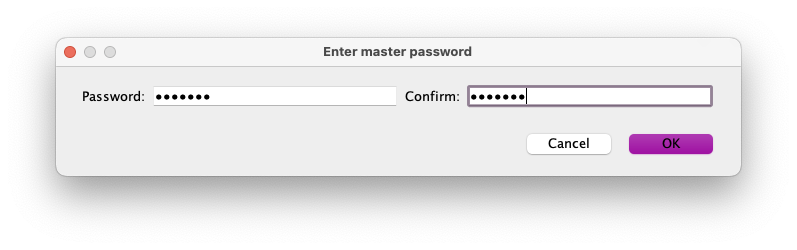

# jdbgen

## Introduction

jdbgen is a tool for generating text(source) files from database table
informations.

If you want to create model class in java or table headers in html
from database table, this tool will fit perfectly as you need.

## UI Workflow

### Master Password

Master password is used to encrypt/decrypt your database connection informations.

At the first time you run application, master password setting window appeared.



Next time you run the program, master password asking window appeared.


> Note! If you forgot master password, all customized informations will be lost.

### Connection Manager Window


Managing database connection informations, connection dependent templates and
options.

#### General Tab

|Name|Descriptions|
|---:|:---|
|Connection Name|Unique connection name which will be shown in left list|
|Driver|JDBC driver(can be managed by [Driver Manager Window](#driver-manager-window))|
|Connection URL|JDBC driver specific connection URL to database|
|User Name|Database user name|
|User Password|Database user password|
|Icon|Icon used in connection list(see [Icons Usage](#icons-usage))|
|Connection Props|Additional connection properties|
|Keep Alive|Execute dummy query every N seconds to keep alive connection|

#### Templates Tab


|Name|Descriptions|
|---:|:---|
|Template Name|A name for identifing template file|
|Template File|Template file location([Template Instructions](#template-instructions))|
|Output Name Template|Output file name template([Template Instructions](#template-instructions))|

You can create/manage template presets in [Template Preset Window](#template-preset-window).

#### Options Tab


|Name|Descriptions|
|---:|:---|
|Output Directory|Where the generated output files are written.|
|Author Name|Author text(`${author}` in template) which used in template.<br/>(ex. John Doe &lt;john.doe@abc.com&gt;)|
|Custom Variables|User defined `item type` variables which used in templates.|

### Driver Manager Window


Managing JDBC driver information, driver dependent properties.

Built-in drivers are cannot be modified in this window, but you can
create/clone driver informations.

#### General Tab

|Name|Descriptions|
|---:|:---|
|Driver Name|Unique driver name which will be shown in left list|
|JDBC Jar|JDBC driver(can be downloaded by [Maven Repository Window](#maven-repository-window)|
|URL Template|Driver specific JDBC connection URL template,<br/>which shown when creating new connection|
|Driver Class|`java.sql.Driver` implementation class<br/>(when click this field, implementation class list will be shown)|
|User Password|Database user password|
|Icon|Icon used in driver list(see [Icons Usage](#icons-usage))|
|Connection Props|Additional connection properties for this driver|

#### Custom Queries Tab


|Name|Descriptions|
|---:|:---|
|Get table comments|Getting table comments from schema in SQL(`${catalog}` and `${schema}` available)|
|Get table column comments|Getting table column comments from table in SQL(`${catalog}`, `${schema}` and `${table}` available)|
|Get table list|Getting tables from schema in SQL(`${catalog}` and `${schema}` available)|
|Get table column list|Getting table column list from table in SQL(`${catalog}`, `${schema}` and `${table}` available)|

### Template Presets Window


Managing set of templates for specific usage.

|Name|Descriptions|
|---:|:---|
|Template Presets|List of defined presets|
|Preset Name|Unique name of preset which will be shown in left list|
|New Preset from Current Connection|When clicked, all templates of current connection<br/>will be copied int current preset with new preset name|
|Apply to Current Connection|When clicked, templates of current connection<br/>will be replaced with current preset templates|
|Template Name|A name for identifing template file|
|Template File|Template file location([Template Instructions](#template-instructions))|
|Output Name Template|Output file name template([Template Instructions](#template-instructions))|

### Maven Repository Window


JDBC driver search and download.

### Generator Main Window


Generating text files using table information and templates.

|Name|Descriptions|
|---:|:---|
|Connection|Current selected database connection|
|Catalogs/Schemas|Database catalog and schema tree, select leaf node to be generated.|
|Show Views|Toggle to show/hidden views in table list|
|Tables|Table/View list of current schema|
|Templates|Select template to be generated, click `Select` table header to select/deselect all template|
|Output Directory|Output location of generated text/source files|
|Author Name|Author text(`${author}` in template) which used in template.<br/>(ex. John Doe &lt;john.doe@abc.com&gt;)|
|Custom Variables|User defined `item type` variables which used in templates.|
|Dark UI|Change UI theme to dark/light.|
|Generate|Start generate process, [Progress Window](#progress-window) will be shown.|
|Close|Close program|

### Progress Window


Shows progress/logs of generating process.


## Icons Usage

Icon can be specified with four types:
1. Local image/icon file.
1. [FontAwesome v4.7 icons](https://fontawesome.com/v4/icons/).
1. Color bullet.
1. Stock icons.

### Local image/icon file

This type can be specified by local filesystem absolute/relative path,
"jpg", "jpeg", "tiff", "tif", "gif", "png" and "ico" files can be used.

example: `/home/user/sample.png`

### FontAwesome v4.7 icons

FontAwesome icon is used for many web/application products recent years.
v4.7 version is used in this application.
Actually [`jiconfont-font_awesome`](https://jiconfont.github.io/fontawesome)
is used in this application.

You can specify FontAwesome icon using 'fa:' prefix in `Icon` field.
Icon color will be same as default font color.

Examples:

|Icon|Field String|
|:---:|:---|
||`fa:table`|
||`fa:eye`|
||`fa:window_restore`|

### Color bullet

Color bullet is simple color circle icon,
"white", "light_gray", "gray", "dark_gray", "black", "red", "pink", "orange",
"yellow", "green", "magenta", "cyan" and "blue" can be used.

You can specify color bullet icon using 'color:' prefix in `Icon` field.

Examples:

|Icon|Field String|
|:---:|:---|
|<font color="blue">&#x2B24;</font>|`color:blue`|
|<font color="green">&#x2B24;</font>|`color:green`|
|<font color="red">&#x2B24;</font>|`color:red`|

### Stock icons

This icons used for application internal needs, database brand icon mostly.

All available stock icons are:

|Icon|Field String|
|:---:|:---|
||`stock:altibase.png`|
||`stock:cubrid.png`|
||`stock:generic.png`|
||`stock:h2.png`|
||`stock:mariadb.png`|
||`stock:mongodb.png`|
||`stock:mssql.png`|
||`stock:mysql.png`|
||`stock:oracle.png`|
||`stock:postgresql.png`|
||`stock:sqlite.png`|


## Template Instructions

Template is created in text and uses predefined character sequence,
basically opened with `${` and closed with `}` characters.

Here is a sample which shows how does it works.

If we have a database table created with below SQL script:
```sql
create table t_sample_album (
  album_id int not null,
  album_name varchar(256) not null,
  artist_name varchar(512) not null,
  publish_date DATE,
  primary key (album_id)
);
comment on table t_sample_album is 'Music Album';
comment on column t_sample_album.album_id is 'Album identifier';
comment on column t_sample_album.album_name is 'Album display name';
comment on column t_sample_album.artist_name is 'Creator artist name';
comment on column t_sample_album.publish_date is 'Published date';
```

And we have a template like:
```java
/**
 * ${remarks} Model class
 *
 * @author ${author}
 * @version 1.0 ${date:yyyy-MM-dd}
 */
class ${table.suffix.pascal}Model {
    ${for:item=columns}// ${remarks}
    private ${item:key=javaType, padSize=10, padDir=right} ${name.camel};
    ${endfor}
    // Getters and Setters
    ${for:item=columns}
    // get ${remarks}
    public ${javaType} ${if:item=javaType, equals='boolean'}is${else}get${endif}${name.pascal}() {
        return ${name.camel};
    }

    // set ${remarks}
    public void set${name.pascal}(${javaType} ${name.camel}) {
        this.${name.camel} = ${name.camel};
    }
    ${endfor}
}
```

This template will generate below code:
```java
/**
 * Music Album Model class
 *
 * @author John Doe <john.doe@abc.com>
 * @version 1.0 2024-08-12
 */
class SampleAlbumModel {
    // Album identifier
    private Integer    albumId;
    // Album display name
    private String     albumName;
    // Creator artist name
    private String     artistName;
    // Published date
    private Date       publishDate;
    
    // Getters and Setters
    
    // get Album identifier
    public Integer getAlbumId() {
        return albumId;
    }

    // set Album identifier
    public void setAlbumId(Integer albumId) {
        this.albumId = albumId;
    }
    
    // get Album display name
    public String getAlbumName() {
        return albumName;
    }

    // set Album display name
    public void setAlbumName(String albumName) {
        this.albumName = albumName;
    }
    
    // get Creator artist name
    public String getArtistName() {
        return artistName;
    }

    // set Creator artist name
    public void setArtistName(String artistName) {
        this.artistName = artistName;
    }
    
    // get Published date
    public Date getPublishDate() {
        return publishDate;
    }

    // set Published date
    public void setPublishDate(Date publishDate) {
        this.publishDate = publishDate;
    }
    
}
```

### Control Templates

Contol templates branch with condition or iterates items.

#### `if` Statement

`if` statement branchs process with conditional statement.

```
${if:item=<field>, <condition>}
 ...    // conditions met
[${elif:item=<field>, <conditions>} ...]
 ...    // another condition met, multiple elif can be used
[${else}]
 ...    // condition not met
${endif}
```

Where `field` is a member of current object(table or column).
`conditions` can be one of -

|Condition|Description|
|:---:|:---|
|`[value\|equals]=<value>`|When item value is equals `<value>`|
|`notEquals=<value>`|When item value is not equals `<value>`|
|`startsWith=<prefix>`|When item value starts with `<prefix>`|
|`endsWith=<suffix>`|When item value ends with `<suffix>`|
|`contains=<item>`|When item collection contains `<item>`|
|`notContains=<item>`|When item collection not contains `<item>`|

Multiple `elif` statement can be used and `else` statement is optional.
`if` statement must be closed with `endif` statement.

Examples:
```
This is ${if:item="type", startsWith="TABLE"}physical table${else}not table${endif}.
This is
${if:item="type", equals="albumId"}
pysical table
${elif:item="type", equals="VIEW"}
virtual view
${else}
unknown object ${type}
${endif}.
```

#### `for` Statement

`for` statement repeats inside contents using collection items.

```
${for:item=<collection field>[, <controls>]}
 ...    // repeats
${endfor}
```

Where `collection field` is a collection type member of current object(obiously table object),
`for` statement must be closed with `endfor` statement.

`collection field` can be one of -

|Collection Field|Description|
|:---:|:---|
|`columns`|All columns in current table object|
|`keys`|Primary key fields in current table object|
|`notKeys`|All columns except primary keys in current table object|

and `controls` can be combination of -

|Control|Description|
|:---:|:---|
|`inStr=<infix>`|Appends `<infix>` between iterations.|
|`indent=<spaces>`|An integer value applied after line break, can be negative.|
|`skipList=<skips>`|When item value ends with `<suffix>`|

> Note! Only collection item is accessible inside `for` statement, if you want
> to access outer object use `super` statement.

Examples:
```sql
SELECT ${for:item=columns, inStr=","}
       ${name} AS "${name.camel}"${endfor}
  FROM ${table}
 WHERE ${for:item=keys, inStr="AND ", indent=-4}${name} = #{${name.camel}}
       ${endfor}
```

### `item` Statement

Item means member field of table/column object in this application.

```
${<field name>[<decorators>]} or
${item:key=<field name>[<decorators>][, <extra decorators>]}
```

Where `field name` is member field name of table/column.

`decorators` can be combination of -

|Decorator|Repeatable|Description|
|:---:|:---:|:---|
|`.suffix`|&#x25EF;|Remove prefix including first `_` in value(ex. `T_SAMPLE_ALBUM` -> `SAMPLE_ALBUM`)|
|`.prefix`|&#x25EF;|Remove suffix including last `_` in value(ex. `SAMPLE_ALBUM_T` -> `SAMPLE_ALBUM`)|
|`.camel`|&#x2715;|Change value to camel case(ex. `SAMPLE_ALBUM` -> `sampleAlbum`)|
|`.pascal`|&#x2715;|Change value to pascal case(ex. `SAMPLE_ALBUM` -> `SampleAlbum`)|
|`.lower`|&#x2715;|Change value to lower case(ex. `SAMPLE_ALBUM` -> `sample_album`)|
|`.upper`|&#x2715;|Change value to upper case(ex. `sample_album` -> `SAMPLE_ALBUM`)|

`extra decorators` can be combination of -

|Decorator|Description|
|:---:|:---|
|`padSize=<size>`|Appends spaces to make value length fit to `size`.|
|`padDir=<direction>`|`left` or `right`, where the spaces appended to.|
|`quote=<quote>`|Wrap value with `quote` string.|
|`prepend=<prepend>`|Prepend `prepend` string to value.|
|`postpend=<postpend>`|Postpend `postpend` string to value.|

Examples:
```
// if table like : T_SAMPLE_ALBUM ( ALBUM_ID, ALBUM_NAME )

${name.suffix.pascal}   // same as ${item:key=name.suffix.pascal}
// results SampleAlbum

[${for:item=columns, inStr=", "}${item:key=name.camel, quote="\""}${endfor}]
// results ["albumId", "albumName"]
```

Databse table object member fields:

|Member Field|Type|Description|
|:---:|:---:|:---|
|`catalog`|String|Database catalog where this table included.|
|`schema`|String|Database schema where this table included.|
|`name`|String|Table name.|
|`table`|String|Alias of `name`|
|`type`|String|JDBC compliant table type(`TABLE`, `VIEW`)|
|`remark`|String|Table comments|
|`columns`|Collection|All columns in current table|
|`keys`|Collection|Primary keys of current table|
|`notKeys`|Collection|All columns of current table except primary keys.|

Database column object member fields:

|Member Field|Type|Description|
|:---:|:---:|:---|
|`catalog`|String|Database catalog where this column included.|
|`schema`|String|Database schema where this column included.|
|`table`|String|Database table where this column included.|
|`name`|String|Column name.|
|`column`|String|Alias of `name`|
|`typeName`|String|Column data type name|
|`length`|Integer|Column data type length|
|`remarks`|String|Column comments|
|`nullable`|Integer|`0` or `1`. `1` is nullable|
|`isKey`|Boolean|`true` if this column is primary key|
|`defVal`|String|Default value of this column|
|`typeString`|String|Combination of `typeName` and `length`(ex. `VARCHAR(40)`).|
|`jdbcType`|String|JDBC compliant type name.|
|`javaType`|String|Corresponding java type name|
