# User Interface Guide

This guide walks through every window jdbgen shows, in roughly the order you meet them: the startup checks, the master password prompt, the Connection Manager and Driver Manager, the helper dialogs (Maven Repository Explorer, Template Presets, Abbreviation Mapping), the Generator main window, and the informational dialogs. Each section lists the real on-screen labels, what every control actually does, and the behaviour that is easy to get wrong. Template syntax is covered in [Template Reference](template-reference.md), the driver-dependent SQL in [Custom Queries](custom-queries.md), and the `Icon` field format in [Icons](icons.md).

[← Documentation index](README.md)

---

## Startup sequence

Three things happen before the main window becomes usable, in this exact order:

1. **Update check.** jdbgen reads its own version from the bundled `version.properties` and queries the GitHub Releases API for the latest release tag. If the release tag is numerically newer, an `Update Available` confirmation appears: *"New version `<tag>` is available. Do you want to update now?"* Choosing **Yes** downloads the release archive — a progress window with a `Cancel` button appears — installs it over the installation directory and restarts jdbgen; cancelling the download continues the startup as if you had said no. If the update cannot be installed, an error is shown and jdbgen offers to open the [releases page](https://github.com/xcomart/jdbgen/releases/latest) in your browser instead, exiting if you accept. Choosing **No** continues startup. If the version cannot be determined, or the network call fails, the check is silently skipped. See [Updating](installation.md#updating) for which files are replaced.
2. **Master password.** See [Master password](#master-password) below. This is where `config.json` is decrypted.
3. **Connection Manager.** The main window is built, then the [Connection Manager](#connection-manager) opens **modally** on top of it. It is not optional: pressing `Cancel` (or closing the window) at this point **terminates the program**. Press `Connect` on the connection you want, and the main window opens the database in the background.

> **Note**
> The update check runs *before* the master password prompt, so a slow or unreachable network delays the password dialog by up to 60 seconds (the HTTP timeout).

---

## Master password

`config.json` is protected by a master password that you choose on first run. Only three fields are encrypted with it — `connectionUrl`, `userName` and `userPassword` of every connection. Everything else (drivers, templates, presets, abbreviations, options) is stored as plain JSON. See [Installation](installation.md) for the storage format and the encryption details.

### First run — setting the password

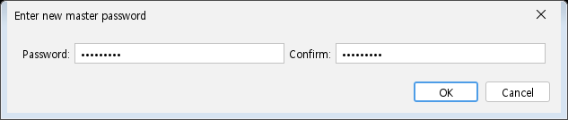

When no `config.json` exists, the dialog title reads **`Enter new master password`** and it contains two fields.

| Field | Setting | Format / constraints | Default |
|:---|:---|:---|:---|
| `Password:` | The master password | Any text; no length or complexity rule is enforced | *(empty)* |
| `Confirm:` | Repeat of the same password | Must match `Password:` exactly | *(empty)* |

If the two do not match, an error box says `Password/Confirm does not match.` and the dialog reopens with the fields cleared. `Cancel` (or closing the dialog) exits the program.

### Later runs — entering the password

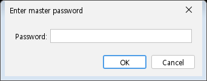

On subsequent runs the title reads **`Enter master password`** and only the `Password:` field is shown. `Cancel` exits the program.

### If the password is wrong

Your configuration is never thrown away silently. The recovery flow is:

| Attempt | What happens |
|:---|:---|
| 1st, 2nd failure | An error box shows `Password Incorrect!` and the password dialog reopens straight away. |
| 3rd failure | A `Configuration Error` confirmation appears. It reports how many attempts failed, the last underlying error, and states *"Your configuration file has NOT been changed."* The two choices are spelled out in the message: **[OK] Try the password again** and **[Cancel] Start with a default configuration**. |
| After `OK` | The failure counter is **reset to zero**, so you get another three attempts before the dialog returns. There is no limit on the number of retries. |
| After `Cancel` | A second confirmation, `Start With Default Configuration`, explains that a default configuration will be created, a new master password will be asked for, and that your current configuration is *kept as a backup file* next to `config.json`. Declining this exits the program. |

When you do accept the default configuration:

- The existing `config.json` is **moved**, not deleted, to `config.json.<yyyyMMdd_HHmmss>.bak` in the same directory.
- An information box then shows the **absolute path** of that backup and tells you: *"Restore it by renaming the file back to `config.json`."*
- If the backup cannot be created (for example the directory is read-only), jdbgen reports it and exits **without touching the original file**.
- If writing the new default configuration fails afterwards, the backup is moved back into place, so you are never left with no configuration at all.

> **Note**
> Losing the master password does **not** destroy your settings — the file survives as a `.bak`. What is genuinely unrecoverable is the *content* of the three encrypted fields: the connection URL, the database user name and the database password of every connection. Everything else can be read out of the backup file with a text editor.

---

## Connection Manager

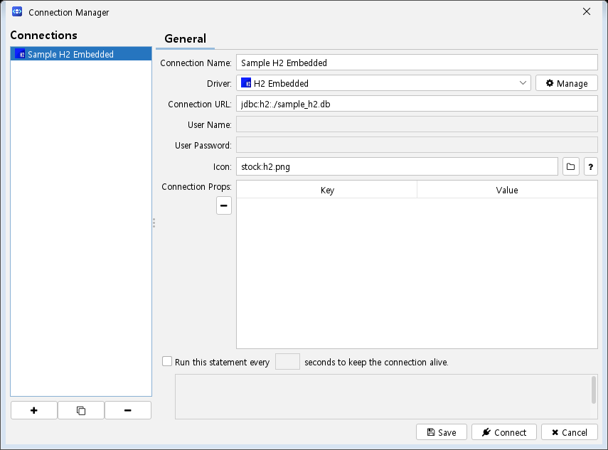

Window title: **`Connection Manager`**. This is where a database connection, the templates it generates, and its output options are defined. It opens automatically at startup and can be reopened at any time from the `Manage` button of the [Generator main window](#generator-main-window).

The left pane, headed **`Connections`**, lists every configured connection; the right pane is a three-tab editor for the selected one. Double-clicking a connection in the list is a shortcut for `Connect`.

### Connections list buttons

| Button | Tooltip | Action |
|:---:|:---|:---|
| `+` | Create New Connection | Adds a connection named `New Connection` (`New Connection - 2`, `- 3` … if the name is taken) and selects it. |
| `c` | Clone Current Connection | Copies the selected connection as `Copy of <name>`, including its props, custom variables and templates. |
| `-` | Remove Current Connection | Asks `Remove Connection Confirm` — *"You realy want to delete '`<name>`' connection?"* — then removes it **and writes `config.json` immediately**. |

> **Note**
> `+` and `c` add the new entry to the in-memory configuration straight away. Pressing `Cancel` afterwards closes the window but does **not** undo the addition, so the stray entry will be written to disk by the next save from anywhere in the application. Delete it explicitly with `-` if you do not want it.

### General tab

| Field | Setting | Format / constraints | Default |
|:---|:---|:---|:---|
| `Connection Name:` | The name shown in the list and in the generator's connection combo | Required; must be unique among connections | `New Connection` |
| `Driver:` | Which JDBC driver definition to use | Required; picked from the drivers defined in the [Driver Manager](#driver-manager) | *(none selected)* |
| `Connection URL:` | JDBC URL passed to the driver | Required; **encrypted** in `config.json` | Filled from the driver's URL template — see below |
| `User Name:` | Database user | Required unless the driver is flagged *no authentication*; **encrypted** | *(empty)* |
| `User Password:` | Database password | Required unless the driver is flagged *no authentication*; **encrypted** | *(empty)* |
| `Icon:` | Icon shown next to this connection | Text field; accepts the icon forms described in [Icons](icons.md) | Copied from the driver when it starts with `stock:` |
| `Connection Props:` | Extra JDBC properties passed to `DriverManager` | Two-column `Key` / `Value` table | Reset to the driver's props whenever a driver is selected |
| `Keep connection alive using below statement every … seconds.` | Interval and SQL of a keep-alive query | Checkbox enables the seconds field and the SQL text area; both become required on save while checked | Unchecked |

Buttons on this tab:

| Button | Tooltip | Action |
|:---:|:---|:---|
| `Manage` | Manage Drivers | Opens the [Driver Manager](#driver-manager) modally, preselecting the driver currently chosen here. The driver combo is rebuilt when it closes. |
| `...` (next to `Icon:`) | Browse Icon File | Opens a file chooser filtered to image files and puts the chosen path into `Icon:`. |
| `?` (next to `Icon:`) | — | Opens the icon documentation for the running version in your browser. |
| `-` (under `Connection Props:`) | — | Removes the selected property row (the last remaining row is cleared instead of removed). |

> **Note**
> Keep-alive runs the statement on a daemon timer for as long as the connection
> is open. If a metadata query or a generation run is using the connection when
> a tick comes due, that tick is skipped rather than queued — the connection is
> demonstrably alive anyway. A failing statement is logged and the timer keeps
> running. An interval that is not a positive whole number of seconds disables
> keep-alive and logs a warning; it never prevents the connection itself.

**Choosing a driver rewrites four things.** Selecting an entry in `Driver:` immediately:

1. replaces `Connection URL:` with the driver's URL template — but only if the URL is empty or still contains a `<` placeholder, so an already-working URL is left alone;
2. replaces `Icon:` with the driver's icon, but only if the current value starts with `stock:`;
3. **clears and refills the `Connection Props:` table** from the driver's properties — any per-connection property you typed there is lost;
4. disables `User Name:` and `User Password:` when the driver has *Authentication is not required for this driver* checked.

### Templates tab

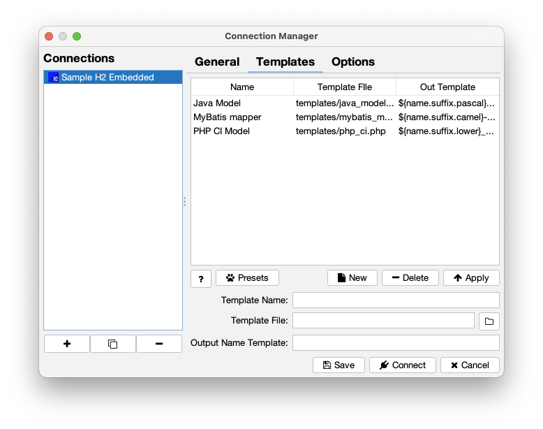

The templates listed here are the ones offered for generation when this connection is active. The table columns are `Name`, `Template FIle` and `Out Template`, and all three are editable in place; the fields underneath edit the selected row.

| Field | Setting | Format / constraints | Default |
|:---|:---|:---|:---|
| `Template Name:` | Label shown in the generator's template list | Free text | *(empty)* |
| `Template File:` | Path to the template file | Relative to the jdbgen working directory when the file is picked underneath it; see [Template Reference](template-reference.md) | *(empty)* |
| `Output Name Template:` | Template that produces the output file name | A template expression, e.g. `${name.suffix.pascal}Model.java` | *(empty)* |

| Button | Tooltip | Action |
|:---:|:---|:---|
| `?` | Template Help | Opens the template documentation for the running version in your browser. |
| `Presets` | Manage Template Presets | Opens the [Template Presets](#template-presets) window, handing it this table. |
| `New` | Create New Template | Clears the table selection and the three fields, ready for a new entry. |
| `Delete` | Remove Current Template | Removes the selected row from the table. |
| `Apply` | Apply Selected Template Modification | Writes the three fields back into the selected row — **or appends them as a new row when nothing is selected**. |
| `...` | Browse Template File | File chooser starting in the `templates` directory; stores a path relative to the working directory when possible. |

Hovering a row shows a tooltip with the full `Template Name`, `Template File` and `Output Template`, which is useful when the columns are too narrow.

> The `Template FIle` and `Out Template` column headers are misspelled/abbreviated in the UI. They are reproduced here exactly as they appear on screen.

### Options tab

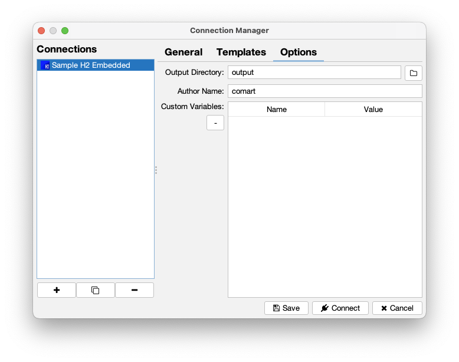

| Field | Setting | Format / constraints | Default |
|:---|:---|:---|:---|
| `Output Directory:` | Where generated files are written | Required; relative paths resolve against the jdbgen working directory | `output` |
| `Author Name:` | Value of `${author}` in templates | Free text, e.g. `John Doe <john.doe@abc.com>` | *(empty)* |
| `Custom Variables:` | User-defined `item`-style variables usable in templates | Two-column `Name` / `Value` table | *(empty)* |

| Button | Action |
|:---:|:---|
| `...` | Directory chooser for `Output Directory:` (this one works). |
| `-` | Removes the selected custom-variable row (the last remaining row is cleared instead). |

### Window buttons and saving

| Button | Action |
|:---:|:---|
| `Save` | Validates the form, copies it into the selected connection and writes `config.json`. The window stays open. |
| `Connect` | Runs the same `Save`, and closes the window on success so the generator can open the connection. |
| `Cancel` | Closes the window without saving the current form. At startup this **exits the program**. |

Validation happens in order and stops at the first problem, focusing the offending field: duplicate name → empty name → empty connection URL → no driver selected → empty user name (unless *no auth*) → empty password (unless *no auth*) → keep-alive SQL / interval missing while keep-alive is checked → empty output directory → incomplete driver definition (which reopens the Driver Manager).

**Key/Value table rules** (they apply to `Connection Props:`, `Custom Variables:` and the driver's property table alike): a trailing empty row is always kept so you can type a new pair; rows whose key *or* value is empty are dropped on save; insertion order is preserved; and a cell being edited is committed when the table loses focus, so you do not have to press <kbd>Enter</kbd>.

---

## Driver Manager

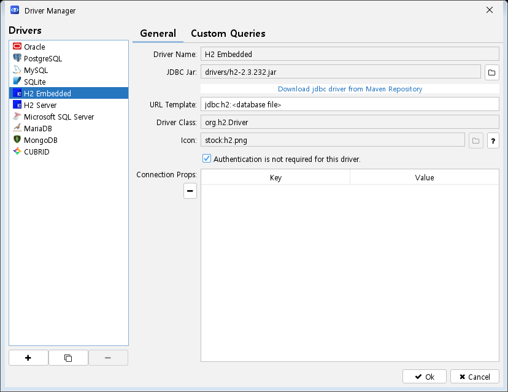

Window title: **`Driver Manager`**. Reached from the `Manage` button on the Connection Manager's General tab. It defines the JDBC jar, driver class, URL template and metadata queries for each database product. The left pane is headed **`Drivers`**.

### Drivers list buttons

| Button | Action |
|:---:|:---|
| `+` | Adds a driver named `New Driver` (`New Driver - 2` …) with the `stock:generic.png` icon and selects it. |
| `c` | Clones the selected driver as `Copy of <name>`; the copy is **not** a stock item, so it is fully editable. |
| `-` | Removes the selected driver with no confirmation. Disabled while a built-in (stock) driver is selected. |

> **Note**
> As in the Connection Manager, `+` and `c` modify the in-memory driver list at once; `Cancel` does not roll them back.

### General tab

| Field | Setting | Format / constraints | Default |
|:---|:---|:---|:---|
| `Driver Name:` | Name shown in the list and in the connection's `Driver:` combo | Required; must be unique. **Read-only for built-in drivers** | `New Driver` |
| `JDBC Jar:` | Path to the driver jar | Required. Stored relative to the working directory when the file lives underneath it | *(empty)* |
| `URL Template:` | Connection URL skeleton offered to new connections | Free text; conventionally uses `<...>` placeholders, e.g. `jdbc:h2:<database file>` | *(empty)* |
| `Driver Class:` | The `java.sql.Driver` implementation to load | Required. **Read-only for built-in drivers.** Clicking the field scans the jar and offers the implementations it finds | *(empty)* |
| `Icon:` | Icon shown in the driver and connection lists | See [Icons](icons.md). **Read-only for built-in drivers** | `stock:generic.png` for new drivers |
| `Connection Props:` | Default JDBC properties for connections using this driver | Two-column `Key` / `Value` table | *(empty)* |
| `Authentication is not required for this driver.` | Marks the driver as needing no credentials | Checkbox. When set, connections using this driver disable and stop requiring `User Name:` / `User Password:` | Unchecked |

| Button | Action |
|:---:|:---|
| `...` (next to `JDBC Jar:`) | File chooser starting in the `drivers` directory, filtered to `.jar` / `.zip` ("Java library files"). |
| `Download jdbc driver from Maven Repository` | Link-styled button that opens the [Maven Repository Explorer](#maven-repository-explorer), pre-searching the driver's stored search term. On success the downloaded path is written into `JDBC Jar:`. |
| `...` (next to `Icon:`) | Icon file chooser. Disabled for built-in drivers. |
| `?` (next to `Icon:`) | Opens the icon documentation in your browser. |
| `-` (under `Connection Props:`) | Removes the selected property row. |

> **Note**
> The claim that built-in drivers cannot be modified is only partly true. On a stock driver, exactly five things are locked: `Driver Name:`, `Driver Class:`, the `Icon:` field and its `...` button, and the `-` delete button. `JDBC Jar:`, `URL Template:`, `Connection Props:`, the *no authentication* checkbox and all four Custom Queries **are editable and are saved** — which is precisely how you point a built-in driver at a jar you downloaded yourself.

> **Note**
> `Driver Class:` populates its pop-up list by opening the jar named in `JDBC Jar:`. Fill in the jar first; clicking the field with no jar set does nothing.

> **Note**
> A driver's `Connection Props:` are only a *template*. They seed the props table of a connection at the moment you choose the driver there. The values actually sent to the JDBC driver at connect time are the connection's own `connectionProps`.

### Custom Queries tab

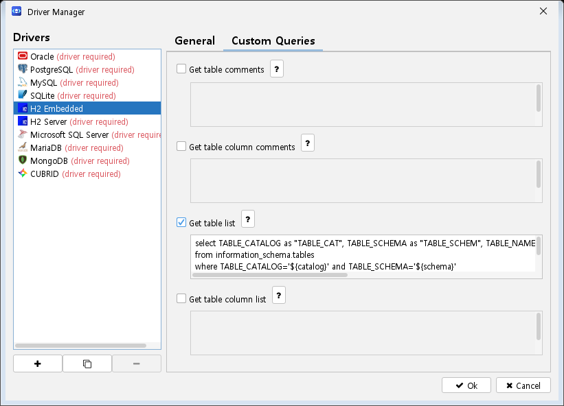

Four independent overrides for the JDBC metadata calls. Each one is a **checkbox + SQL text area + `?` button**. The text area is disabled until the checkbox is ticked; once ticked, the SQL becomes mandatory on save. Leaving a box unticked means jdbgen uses standard JDBC metadata for that lookup. The four can be mixed freely — for example, overriding only the comment queries while letting JDBC list the tables.

| Checkbox | Purpose | Parameters available in the SQL |
|:---|:---|:---|
| `Get table comments` | Table name → table comment | `${catalog}`, `${schema}` |
| `Get table column comments` | Column name → column comment | `${catalog}`, `${schema}`, `${table}` |
| `Get table list` | Table listing | `${catalog}`, `${schema}` |
| `Get table column list` | Column listing | `${catalog}`, `${schema}`, `${table}` |

The `?` button beside each one opens the corresponding section of [Custom Queries](custom-queries.md), which documents the exact result-set columns each query must return, with worked examples. If the table list stays empty for a connection, this tab is the place to fix it.

### Window buttons

| Button | Action |
|:---:|:---|
| `Ok` | Validates, saves the driver, writes `config.json` and closes the window. |
| `Cancel` | Closes without saving the current form. |

Validation order: duplicate name → empty name → empty jar → empty driver class → missing SQL for each ticked custom query.

---

## Maven Repository Explorer

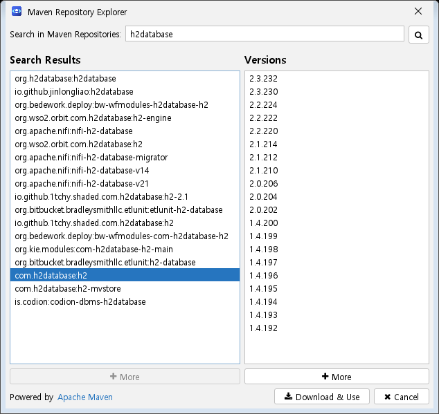

Window title: **`Maven Repository Explorer`**. Opened from `Download jdbc driver from Maven Repository` in the Driver Manager, it searches Maven Central for a driver artifact and downloads the jar for you. When it is opened from a built-in driver it is pre-filled with that driver's search term and searches immediately.

| Control | Purpose | Notes |
|:---|:---|:---|
| `Search in Maven Repositories:` | Search text | Press <kbd>Enter</kbd> or the magnifier button to search. A blank query is ignored. |
| `Search Results` | Matching artifacts | 20 per page. Hovering an entry shows its full coordinates. Selecting one loads its versions. |
| `Versions` | Versions of the selected artifact | 20 per page. |

| Button | Action |
|:---:|:---|
| magnifier | Runs the search from scratch, clearing both lists. |
| `More` (under `Search Results`) | Loads the next 20 results and appends them. When everything has been loaded it reports `No more results`. |
| `More` (under `Versions`) | Loads the next 20 versions. When exhausted it reports `No more versions`. |
| `Download & Use` | Downloads the selected version. Requires a version selection, otherwise it says *"Please select a version to download."* |
| `Cancel` | Closes the window without downloading. |
| `Powered by` `Apache Maven` | A clickable link to `https://maven.org`. |

The download opens a [progress window](#progress) that reports bytes received, saves the jar into the **`drivers/`** directory under its original file name (creating the directory if needed), then reports `Download complete!`, closes the explorer and writes the saved path into the driver's `JDBC Jar:` field. Failures are reported with the underlying error message and leave the explorer open.

> **Note**
> Every HTTP call — search, version lookup and download — uses a 60-second connect/read/write timeout. A large driver jar on a slow link can therefore fail with a read timeout even though the download had started.

---

## Template Presets

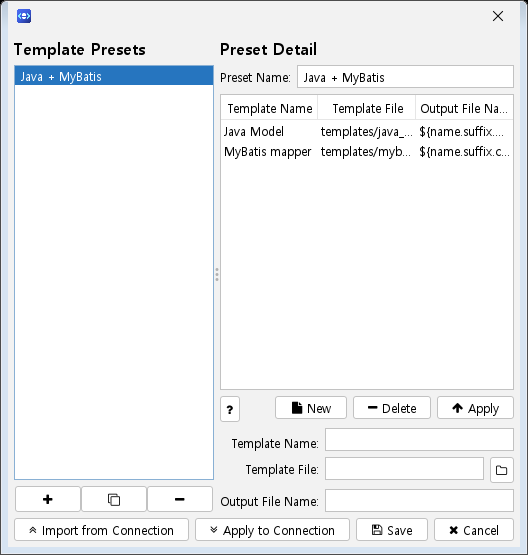

Opened from the `Presets` button on the Connection Manager's Templates tab. A preset is a named, reusable set of templates — a "Java model" set, a "MyBatis" set, and so on — that can be pushed into any connection.

The left pane, **`Template Presets`**, lists the presets. The right pane, **`Preset Detail`**, edits the selected one.

### Preset list buttons

| Button | Action |
|:---:|:---|
| `+` | Creates an empty preset named `New Preset` (`New Preset - 2` …) and selects it. |
| `C` | Clones the selected preset as `Copy of <name>`. |
| `-` | Asks `Delete Preset` — *"Do you want to delete '`<name>`' preset?"* — then removes it from the list. |

### Preset detail

| Field | Setting | Format / constraints | Default |
|:---|:---|:---|:---|
| `Preset Name:` | Name shown in the preset list | Required; must be unique among presets | `New Preset` |
| templates table | The templates in this preset | Columns `Template Name`, `Template File`, `Out Template`; read-only — edit through the fields below | *(empty)* |
| `Template Name:` | Name of the selected/new template | Required once you start adding a template | *(empty)* |
| `Template File:` | Template file path | Required once you start adding a template | *(empty)* |
| `Output Name Template:` | Output file name template | Required once you start adding a template | *(empty)* |

| Button | Action |
|:---:|:---|
| `?` | Opens the template documentation in your browser. |
| `New` | Clears the table selection so the next `Apply` appends a row. |
| `Delete` | Removes the selected template row. |
| `Apply` | Writes the three fields into the selected row, or appends a new row when nothing is selected. All three must be filled in. |
| `New Preset from Current Connection` | **Creates a brand-new preset** and copies the current connection's templates into it. |
| `Apply to Current Connection` | Replaces the Connection Manager's Templates table with this preset's templates. |
| `Save` | Commits any pending template edit, validates the preset name, saves the preset and writes `config.json`. |
| `Cancel` | Closes the window. |

> **Note**
> `New Preset from Current Connection` does **not** copy into the preset you have selected. It always creates a new preset — named `New Preset`, or `New Preset - 2` and so on if that name is taken — and never asks you for a name. Rename it in `Preset Name:` and press `Save`, otherwise nothing is written to disk.

> **Note**
> `Apply to Current Connection` only rewrites the *in-memory* table in the Connection Manager. Nothing is persisted until you go back and press `Save` or `Connect` there.

> **Note**
> As with the other list panes, `+`, `C` and `New Preset from Current Connection` add entries to the shared configuration immediately; `Cancel` does not remove them.

---

## Generator Main Window

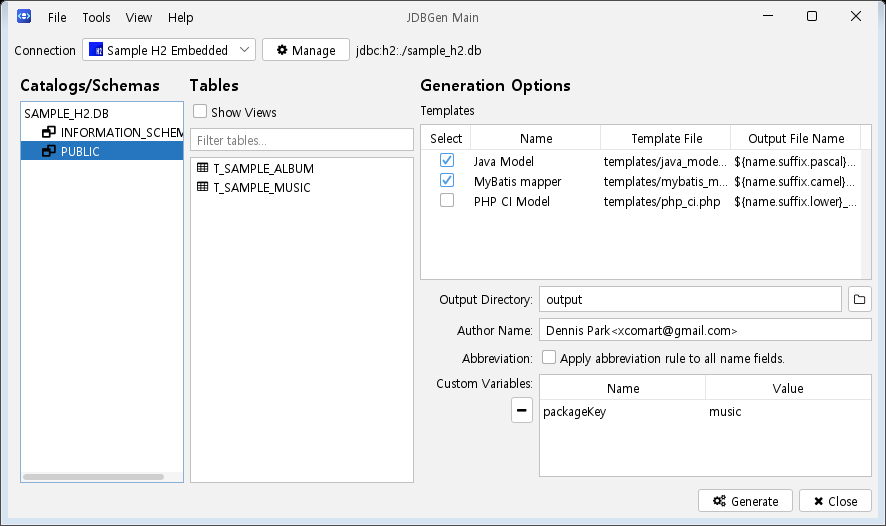

Window title: **`JDBGen Main`**. This is where generation actually happens: pick a schema, pick tables, tick templates, press `Generate`.

### Connection bar

| Control | Purpose | Notes |
|:---|:---|:---|
| `Connection` combo | Selects the active connection | **Changing it connects.** The database is opened on a background thread; while that runs the combo, `Manage` and `Generate` are disabled and the cursor becomes a wait cursor. |
| connection URL label | Shows the URL of the current connection | Deliberately clipped to the first 20 characters so a long URL cannot push the panels off screen. Cleared when a connection fails. |
| `Manage` | Opens the [Connection Manager](#connection-manager) modally, preselecting the current connection | On return the connection list and the current connection's templates/options are reloaded. |
| `A` | Tooltip *About of this program*; opens the [About](#about--acknowledgements) dialog | On macOS the application menu's *About* item does the same. |

If the connection fails, an error box names the connection and the underlying cause, the schema tree and table list are cleared, and the combo selection is reset so that re-picking the same entry retries.

### `Catalogs/Schemas`

A tree of the database's catalogs and schemas.

- With **more than one catalog**, the tree gets a `Database` root, catalogs on the first level and schemas on the second.
- With **one catalog**, that catalog *is* the root and schemas hang directly off it.

**You must select a schema node** for tables to be loaded — selecting a catalog or the root does nothing.

### `Tables`

The table list for the selected schema.

| Control | Purpose |
|:---|:---|
| `Show Views` | Toggles views in and out of the list; re-queries the current schema. |
| table list | Select the tables to generate for. **Multiple selection is supported** (<kbd>Ctrl</kbd>/<kbd>Shift</kbd>-click). |

Hovering a table shows its name as a tooltip. **Double-clicking a table** reads its columns and opens the [Table View](#table-view) window.

### `Templates`

| Column | Purpose |
|:---|:---|
| `Select` | Tick the templates to run. **Clicking the `Select` column header toggles every row on or off.** |
| `Name` | Template name (read-only here) |
| `Template File` | Template file path (read-only here) |
| `Out Template` | Output file name template (read-only here) |

The rows come from the current connection; edit them in the Connection Manager's Templates tab. Hovering a row shows a tooltip with all three values in full.

### `Generation Options`

| Field | Setting | Format / constraints | Default |
|:---|:---|:---|:---|
| `Output Directory:` | Where files are written for this run | Free text. An empty value writes into the working directory | The connection's output directory |
| `Author Name:` | Value of `${author}` for this run | Free text | The connection's author |
| `Custom Variables:` | `Name` / `Value` pairs usable as `item` variables | Same table rules as elsewhere: trailing empty row, blank rows dropped | The connection's custom variables |
| `Abbreviation:` `Apply abbreviation rule to all name fields.` | Applies abbreviation mapping automatically | Checkbox. Ticking or unticking it saves the configuration immediately | Restored from the saved configuration |

| Button | Action |
|:---:|:---|
| `...` (next to `Output Directory:`) | Opens a directory chooser and puts the chosen path into `Output Directory:`, relative to the working directory when it sits below it. |
| `-` (under `Custom Variables:`) | Removes the selected variable row. |
| `Abbreviation Mapper` | Opens the [Abbreviation Mapping](#abbreviation-mapping) window. Independent of the checkbox — the rules can be edited whether or not the checkbox is set. |

> **Note**
> Values you change here — `Output Directory:`, `Author Name:` and `Custom Variables:` — apply to **this generation run only**. They are never written back to the connection. Edit them in the Connection Manager's Options tab to make them stick.

**What the abbreviation checkbox really does.** When ticked, every `item` reference whose *first* key is `name` gets an implicit `abbr` decorator, even when the template does not write `.abbr`. Consequently:

- A template that already spells out `.abbr` is abbreviated **regardless** of this checkbox.
- The alias forms `${table}` and `${column}` are **not** affected — only `name`.
- The `abbr` step is inserted directly after `name`, so it runs before any case or affix decorators that follow.

The checkbox reflects the stored setting when the window opens, and every change
to it is written to `config.json` straight away, so what you see is what
generation will do.

### Bottom bar

| Button | Action |
|:---:|:---|
| `Dark UI` | Switches between the light and dark themes, applies the change to every open window, and saves it to `config.json` immediately. |
| Language | Selects the language of the user interface. |
| `Generate` | Starts generation; opens the [progress window](#progress). |
| `Close` | Closes the database connection and exits the program. |

The language list offers `System Default` — the language of your operating system, and the setting a fresh installation starts with — plus `English`, `한국어`, `Español`, `日本語` and `简体中文`. Each language is named in itself, so you can find yours whatever the window currently speaks. The choice is saved to `config.json` right away, but **it only takes effect the next time you start jdbgen**; a confirmation says so. Anything jdbgen has not translated yet stays English.

`Generate` refuses to start and shows an error when there is no open connection (*"Please connect to a database first."*), when no table is selected (*"Please select at least one table to generate."*), or when no template is ticked (*"Please select at least one template to generate."*).

When the run finishes, a `Process Complete` confirmation asks *"Process complete successfully! Do you want open output directory?"* — accepting opens the output directory in your system file manager. A failed run reports `Process failed!`; the reason is in the progress log and in the application log.

---

## Table View

Opened by **double-clicking a table** in the Generator main window's `Tables` list. It is a read-only look at what jdbgen actually resolved for that table — useful for checking that comments, types and primary keys came through before you spend a generation run on them.

| Element | Content |
|:---|:---|
| table name label | The table name |
| remarks label | The table comment, as returned by JDBC metadata or by your `Get table comments` query |
| `#` | Column ordinal |
| `Name` | Column name |
| `Type` | Type with length, e.g. `VARCHAR(256)` |
| `Key` | Ticked when the column is part of the primary key |

Hovering a row shows that column's comment as a tooltip. `Close` dismisses the window. The table is entirely read-only.

---

## Abbreviation Mapping

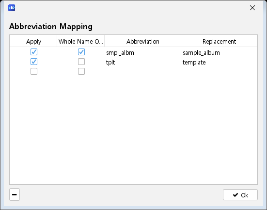

Headed **`Abbreviation Mapping`** and opened from the `Abbreviation Mapper` button. These rules drive the `.abbr` decorator described in [Template Reference](template-reference.md), and the `Apply abbreviation rule to all name fields.` option above.

| Column | Type | Meaning |
|:---|:---|:---|
| `Apply` | checkbox | **Only ticked rows are used.** Unticked rows stay in the file but are ignored when the mapping is built. |
| `Total Name` | checkbox | When ticked, the rule matches the **whole name** rather than a single word inside it. |
| `Abbreviation` | text | The text to look for. |
| `Replace To` | text | What to substitute. |

| Button | Action |
|:---:|:---|
| `-` | Asks for confirmation — *"Do you want to delete '`<abbr>`' -> '`<replacement>`'?"*, or *"delete this row"* for a blank row — then removes it. |
| `Ok` | Writes `config.json` and closes the window. |

### How a name is abbreviated

The order matters, and it is not what the old documentation implied:

1. **Total-name rules are consulted first.** If the whole name matches a ticked `Total Name` rule, it is replaced with `Replace To` and processing **stops** — no word-level rule is applied to that name.
2. Otherwise the name is split on `_` and `-`, and each segment is looked up among the ticked word rules. Segments that match are replaced; the separators are preserved.

> **Note**
> Total-name matching is **case-insensitive**, but word-level matching is not: abbreviation keys are stored lower-cased while the name segments are compared as-is. In practice, word rules only ever fire on already-lower-case segments — a table called `SAMPLE_ALBUM` will not match a word rule for `album`, whereas `sample_album` will. Use a `Total Name` rule for upper-case identifiers.

### Editing behaviour

- A trailing empty row is always kept so you can type a new rule straight away.
- Rows whose `Abbreviation` or `Replace To` is blank are dropped when the list is stored.
- Two ticked rows with the same `Abbreviation` are rejected with `'<abbr>' duplicated.`; the in-memory list is left untouched until you resolve the clash.
- Cell edits are committed when the table loses focus.
- **Right-clicking the `Abbreviation` cell of a row whose `Total Name` is ticked** pops up the list of tables currently loaded in the Generator main window, so you can insert an exact table name instead of typing it. The pop-up appears only for `Total Name` rows and only when a schema's tables have been loaded.
- Edits update the in-memory configuration as you type; `Ok` is what writes them to disk. Closing the window with the title-bar close button keeps the edits in memory but does not save them until some other action writes the configuration.

---

## Progress

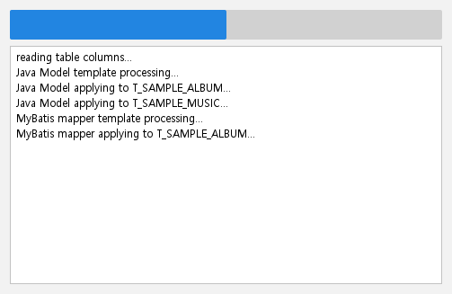

A modal, **title-bar-less** window with just a progress bar and a log area. It has **no cancel and no close button** — it appears when work starts and vanishes by itself when the work ends. The same window is reused for file generation and for Maven driver downloads.

For generation, the log reports the reading of table columns, then each template as it is applied to each table, and the progress bar advances over *(number of selected tables × number of ticked templates)* steps. For a Maven download it reports the target path and the bytes received.

The outcome is reported by the window that started the job — the `Process Complete` / `Process failed!` boxes in the generator, or `Download complete!` in the Maven explorer.

---

## About / Acknowledgements

The **About** dialog opens from the `A` button in the top-right of the Generator main window (tooltip *About of this program*), or from the application menu's *About* entry on macOS.

| Element | Content |
|:---|:---|
| icon | The application icon |
| `JDBGen` | Product name |
| `Version v<version>` | The running version, read from the bundled version properties |
| `Author: Dennis Park` | Author |
| `<xcomart@gmail.com>` | Clickable — opens your mail client with a new message |
| `github:` `https://github.com/xcomart/jdbgen` | Clickable — opens the project page in your browser |

| Button | Action |
|:---:|:---|
| `Acknowledgements` | Opens the Acknowledgements window. |
| `Ok` | Closes the dialog. |

The **Acknowledgements** window is headed `Acknowledgements` and shows the bundled `acknowledgements.txt` — the third-party libraries jdbgen depends on and their licences — in a read-only monospaced text area. `Ok` closes it.

---

## See also

- [Installation](installation.md) — requirements, first launch, where `config.json` lives, and how the encrypted fields are protected
- [Template Reference](template-reference.md) — full template syntax: `item`, `if`, `for`, decorators, and the table/column fields you can reference
- [Custom Queries](custom-queries.md) — the driver-dependent SQL for the Custom Queries tab, with the required result-set columns
- [Icons](icons.md) — the four icon forms accepted by every `Icon` field
- [Troubleshooting](troubleshooting.md) — known defects and their workarounds
